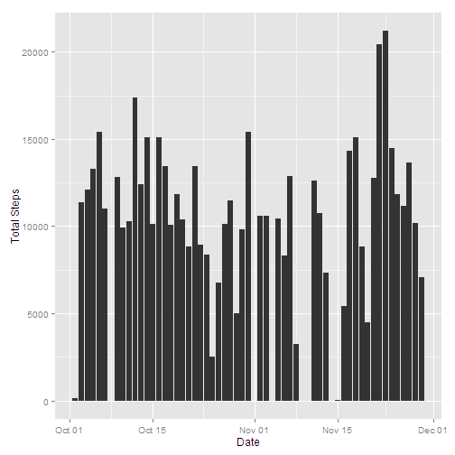
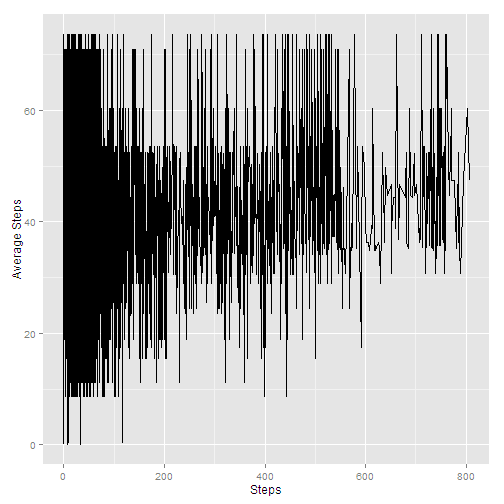
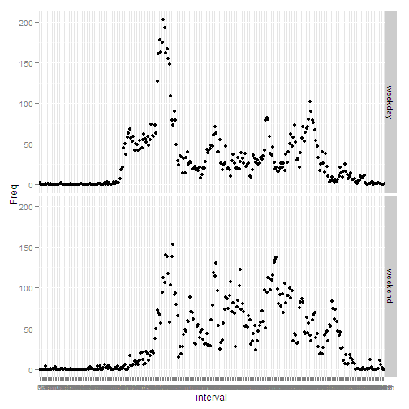

# Reproducible Research: Peer Assessment 1 - By Arindam Ray

## Loading and preprocessing the data


```r
library(data.table)
```

```
## Warning: package 'data.table' was built under R version 3.1.1
```

```r
library(ggplot2)
```

```
## Warning: package 'ggplot2' was built under R version 3.1.1
```

```r
activityRawData = read.csv("activity.csv", header = TRUE)
activityDT <- data.table(activityRawData)
```

## What is mean total number of steps taken per day?


```r
activitySum=activityDT[,sum(steps),by = date]
activitySum =na.omit(activitySum)
activitySum$date=as.Date(activitySum$date)
ggplot(activitySum, aes(x=as.Date(date),y=V1))+ geom_bar(stat = "identity")+labs(x = "Date", y = "Total Steps")
```

 

```r
mean(activitySum$V1,na.rm = FALSE)
```

```
## [1] 10766
```

```r
median(activitySum$V1,na.rm = FALSE)
```

```
## [1] 10765
```

## What is the average daily activity pattern?


```r
activityAvg=activityDT[,mean(steps,na.rm = FALSE),by = date]
activityAvg =na.omit(activityAvg)
activityMtable <- data.table(activityRawData)

activityMtable$date=as.Date(activityMtable$date)
activityAvg$date=as.Date(activityAvg$date)

mergedData=merge(x=activityMtable,y=activityAvg,by="date",by.x="date", by.y ="date")

mergedData$date=as.Date(mergedData$date)
ggplot(mergedData, aes(x=mergedData$steps,y=mergedData$V1),type=1) + geom_line() + xlab("Steps") + ylab("Average Steps")
```

 

```r
max(mergedData$steps)
```

```
## [1] 806
```

## Inputing missing values

```r
(length(which(is.na(activityDT$steps))))
```

```
## [1] 2304
```

```r
activityAvg=activityDT[,mean(steps,na.rm = FALSE),by = date]
activityMtable <- data.table(activityRawData)

activityMtable$date=as.Date(activityMtable$date)
activityAvg$date=as.Date(activityAvg$date)

mergedData=merge(x=activityMtable,y=activityAvg,by="date",by.x="date", by.y ="date")

for (i in 1:NROW(mergedData$steps)) {

  if(is.na(mergedData[i]$steps))
  {
    if(is.na(mergedData[i]$V1))
    {
      mergedData[i]$V1 = 0
      mergedData[i]$steps = 0
      
    }   
    else
       mergedData[i]$steps = mergedData[i]$V1
  }
}

ggplot(mergedData, aes(x=as.Date(date),y=V1))+ geom_bar(stat = "identity")+labs(x = "Date", y = "Total Steps")
```

 

```r
mean(mergedData$V1,na.rm = FALSE)
```

```
## [1] 32.48
```

```r
median(mergedData$V1,na.rm = FALSE)
```

```
## [1] 36.09
```

## Are there differences in activity patterns between weekdays and weekends?


```r
mergedData$day <- weekdays(mergedData$date)
mergedData$dayType <- c("weekday")

for (i in 1:NROW(mergedData$steps)) {

if(weekdays(as.Date(mergedData[i]$date))=="Saturday")
  {
  mergedData[i]$dayType="weekend"
  }else if(weekdays(as.Date(mergedData[i]$date))=="Sunday")
  {mergedData[i]$dayType="weekend"}
else{mergedData[i]$dayType="weekday"}
}

avgStepsNew = data.frame(xtabs(steps ~ interval + dayType, aggregate(steps ~ 
    interval + dayType, mergedData, mean)))
qplot(interval, Freq, data = avgStepsNew, facets = dayType ~ .)
```

 

